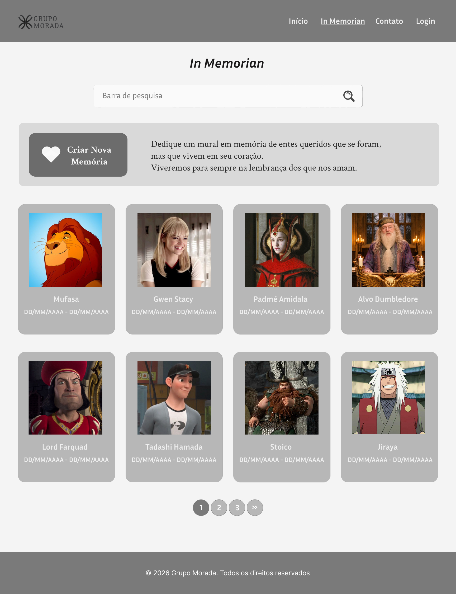
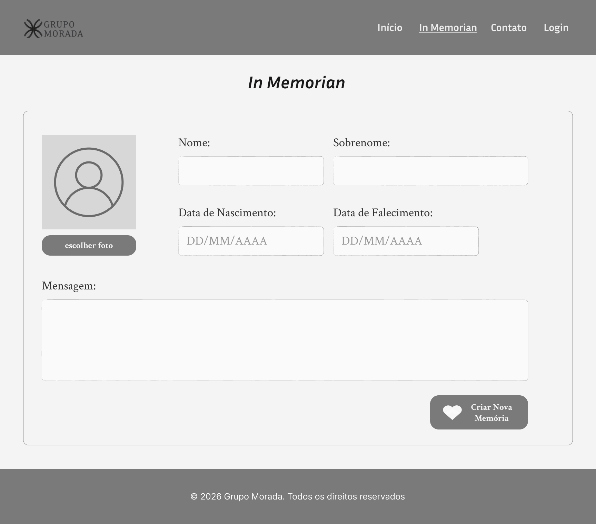

# Projeto Morada – In Memoriam

## Apresentação do Projeto

O **Projeto Morada – In Memoriam** é uma aplicação web que permite criar, visualizar e gerenciar memórias de entes queridos.  
O objetivo é oferecer um mural digital onde os usuários podem dedicar mensagens e postá-las em um mural junto a outras memórias.

## Principais funcionalidades:  

- Visualizar todas as memórias no mural.  
- Criar novas memórias com nome, sobrenome, datas e mensagem.  
- Editar e deletar memórias existentes.

## Protótipos
### Tela Inicial


### Tela Criar Memória


---

## Tecnologias Utilizadas

### Frontend
- Angular CLI 21.1.4
- TypeScript (integrado no angular)
- HTML5 / CSS3

### Backend
- Python 3.11.3 
- Django 5.2.11
- Django REST Framework 3.16.1
- SQLite (integrado ao DRF)

### Outras ferramentas
- Git / GitHub para versionamento  
- Node.js 22.15.0 e npm para gerenciar as dependências do Angular  
- Postman para fazer os testes de API

---

## Instruções para Execução

### 1. Backend (Django REST Framework)

1. Clonar o repositório:  
```bash
>>> git clone https://github.com/adnaolivia/projeto_morada.git
>>> cd backend
```
2. Criar e ativar o ambiente virtual
```bash
>>> python -m venv venv
>>> ./venv/Scipts/activate
```
3. Instalar as dependencias
```bash
>>> pip install -r requirements.txt
```
4. Executar
```bash
>>> python manage.py runserver
```
OBS.: Saída esperada na porta 8000

### 2. Frontend (Angular)
1.abrir diretorio frontend
```
>>> cd frontend
>>> cd proj-morada
```
2. Instalar node modules
```bash
>>> npm install
```
3. Executar
```bash
>>> ng serve
```
OBS.: Saida esperada na porta 4200

## Observações
- Algumas funcionalidades ainda estão em andamento para serem finalizadas.
- última atualização em: 19/02/2026 23:43